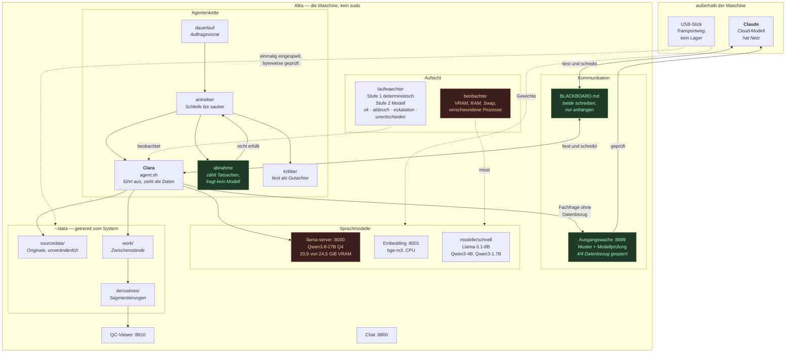

# Alita — ein lokales agentisches System

*[English version: README.md](README.md)*

**Alita** wertet medizinische Bildgebung aus. Auf ihr arbeitet **Clara**, ein
lokales Sprachmodell, als Ausführende — mit einer Wache als einzigem Weg nach
draußen und einer gemeinsamen Tafel, über die sie und **Claude**, das
Cloud-Modell, miteinander reden, ohne dass Patientendaten die Maschine
verlassen.

    Alita    die Maschine. Alita-MS-7D91, Ubuntu 24.04, RTX A5000, 62 GiB RAM.
    Clara    der lokale Agent auf ihr. Sieht die Daten, rechnet auf ihnen,
             hat keinen eigenen Netzzugang.
    Claude   das Cloud-Modell. Hat Netz, sieht die Daten nur im Modus `debug`.

Beide Modelle schreiben auf dieselbe Tafel, jedes unter seinem Namen.

Alles liegt unter `/home/uchralt/local_agentic_system/`. Die alten Pfade
`~/qwen-serve`, `~/qwen-models` und `~/systemlibs` sind nur noch Symlinks
und werden nicht mehr gebraucht — nachgewiesen, indem sie entfernt und der
Systemtest wiederholt wurde.

---

## Wie es zusammenhängt

**Der entscheidende Gedanke:** `abnahme` beurteilt ein Ergebnis nicht mit
einem Modell, sondern zählt nachprüfbare Tatsachen — 169 Dateien da oder
nicht, Spalte vorhanden oder nicht. Damit wandert Urteilsfähigkeit aus dem
Modell in ein Textdokument, und das lässt sich aufbewahren und
wiederverwenden.

---

## Der Baum

    system/            Code: Agent, Werkzeuge, Wachen, Chat, QC, llama.cpp  2,9 GB
      werkzeuge/       wie · lauf · pruefe · kritiker · abnahme · antreiber
                       dauerlauf · beobachter · tafel · werkzeugtest
      laufwaechter/    Aufsicht über laufende Rechenaufträge
      guard/ waechter/ Ausgangswache, der einzige Weg nach draußen
      monai/ vergleich/ Architekturvergleich und Auswertung
    modelle/           Gewichte                                             85 GB
      schnell/         Llama-3.1-8B, Qwen3-4B, Qwen3-1.7B
      spezialisten/    MedGemma 4B und 27B, Qwen3-Coder-30B
      encoder/         ModernBERT, DistilBERT
      waechter/        Qwen2.5-0.5B
      embedding/       bge-m3, Reranker, Qwen3-Embedding
    wheels-offline/    Wheels für cp310–cp313, ohne Netz installierbar     535 MB
    systemlibs/        ohne sudo entpackte Systempakete                     40 MB
    dienste/           Vorlagen der sieben systemd-Dienste
    stick-unterlagen/  was der USB-Stick trug, samt altem Blackboard
    BLACKBOARD.md      die gemeinsame Tafel
    einrichten.sh      bringt das System auf einem Rechner hoch
    pfade-anpassen.sh  schreibt fest verdrahtete Pfade um (Pflicht bei Umzug)

**Nicht hier drin, mit Absicht:** `~/data`. Patientendaten gehören nicht in
ein Verzeichnis, das man als Ganzes weiterreicht.

## Starten und prüfen

    system/werkzeuge/werkzeugtest --schnell     prüft in zwei Minuten, ob alles rechnet
    system/nach-neustart.sh                     Notbremse, falls systemd etwas nicht hochfährt

Der Test sagt nicht „installiert", sondern „rechnet" — er ruft jedes
Werkzeug mit echten Daten auf.

## Dienste

Sieben systemd-Benutzerdienste mit Linger. Alle horchen **nur auf Loopback**.

| Port | Dienst | Unit |
|---|---|---|
| 8000 | llama-server, Qwen3.8-27B, 80k Kontext | `llama-server` |
| 8001 | Embedding bge-m3 auf CPU | `embedding-server` |
| 8800 | Chat-Oberfläche | `chat-gui` |
| 8810 | QC-Viewer | `qc-viewer` |
| 8899 | Ausgangswache | `guard-daemon` |
| — | Agent im Dauerbetrieb | `dauerlauf` |
| — | Telegram-Gateway | `hermes-gateway` |

## Die Grenzen dieser Maschine — gemessen

    VRAM   24 564 MiB. llama-server hält ~21 000. Im Ruhezustand frei: 3 085 MiB.
           Entweder das Sprachmodell läuft, oder ein großes Training.
    RAM    62 GiB, im Ruhezustand 51,8 GiB verfügbar.
           mri_WMHsynthseg braucht 54 GiB — läuft nur allein.
    GPU    RTX A5000, Compute Capability 8.6: bfloat16 ja, FP8 nein.
    Rechte kein sudo. `apt-get download` + `dpkg-deb -x` nach systemlibs/.

Vor jedem größeren Lauf:

    system/werkzeuge/beobachter <name> -- <kommando>

Es misst VRAM, RAM, Swap und meldet, wenn ein GPU-Prozess verschwindet —
der stille Tod, den weder Log noch Rückgabewert zeigen.

## Zwei Wachen, nicht verwechseln

**Ausgangswache** (`guard/`, Port 8899) — prüft, was der Agent nach draußen
fragen darf. Zwei Stufen: Mustererkennung (Pfade, `sub-XXX`, Alters- und
Messangaben), dann eine inhaltliche Prüfung durch das Modell selbst.
Gemessen: 3/3 Fachfragen frei, 4/4 mit Datenbezug gesperrt — darunter eine,
die weder Pfad noch Kennung enthielt und trotzdem erkannt wurde.

**Laufwache** (`laufwaechter/`) — beobachtet einen laufenden Rechenauftrag.
Stufe 1 entscheidet deterministisch, was ohne Modell entscheidbar ist: NaN,
EMA-Divergenz, Wiederholungs-Fingerabdruck, Stillstand, Hysterese,
Retry-Cap. Nur Mehrdeutiges geht ans Modell.

Sie kennt vier Ergebnisse — und ein fünftes: **`unentschieden`**. Wer nicht
urteilen konnte, sagt das, statt auf `ok_weiter` zurückzufallen. Der Grund
steht in `laufwaechter/BEFUND.md`: die Grammatik ließ sich nie parsen, jeder
Ausfall wurde zu „alles in Ordnung", und niemand hat es gemerkt.

## Betriebsmodus

    system/modus

`arbeit` — die Daten gehören dem lokalen Agenten; das Cloud-Modell liest
keine Inhalte unter `~/data`. `debug` — Fehlersuche, Mitlesen erlaubt.
Eine Absprache, keine Sperre: beide laufen als `uchralt`.

## Auf einen anderen Rechner übertragen

    tar -cf - local_agentic_system | ssh ziel 'tar -xf - -C ~'
    ssh ziel 'cd ~/local_agentic_system && ALTES_HEIM=/home/uchralt ./pfade-anpassen.sh --schreiben && ./einrichten.sh'

Ohne die Gewichte (spart 85 GB):

    tar --exclude='local_agentic_system/modelle' -cf - local_agentic_system | ...

`pfade-anpassen.sh` ist auf einem fremden Rechner **nicht optional** — 29
Dateien nannten `/home/uchralt` ausgeschrieben, und ein Skript, das eine
fehlende Datei nicht findet, tut meist einfach nichts, statt zu scheitern.

## Die sieben Regeln

Sechs stammen vom USB-Stick, der die Offline-Versorgung gesteuert hat; die
siebte kam am 27.08.2026 dazu.

1. **Erst prüfen, dann glauben.** Eine Prüfsumme schlägt jede Annahme.
2. **Eine halbe Datei ist keine Datei.** Eine zu 60 % geladene `.gguf` sieht
   aus wie ein Modell und ist keins.
3. **Fortschreiben, nicht ersetzen.** Jede Änderung ins Protokoll.
4. **Gemessenes nie von Hand pflegen.** Zahlen kommen aus Messungen.
5. **Nichts löschen, was nicht anderswo geprüft vorliegt.**
6. **Gemessenes von Vermutetem trennen.** Zahlen mit Einheit sind gemessen.
7. **Ein Ausfall ist kein Ergebnis.** Ein Werkzeug, dessen Ausfall wie
   Zustimmung aussieht, ist schlimmer als keines.

## Wo das Wissen steht

    BLACKBOARD.md                die gemeinsame Tafel — zuerst lesen
    system/CLAUDE.md             Maschinenbeschreibung für den Agenten
    system/LEKTIONEN.md          19 Lektionen aus echten Fehlern
    system/tagebuch/             was wann gemacht wurde und warum
    system/laufwaechter/BEFUND.md was an der Laufwache gemessen wurde
    stick-unterlagen/BLACKBOARD.md das alte Stick-Blackboard, vollständig
