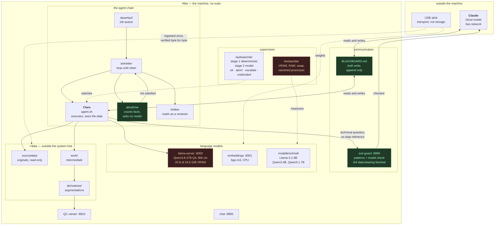

# Alita — a local agentic system

*[Deutsche Fassung: README.de.md](README.de.md)*

**Alita** analyses medical imaging. On her runs **Clara**, a local language
model, as the executing agent — with a guard as her only way out and a shared
blackboard through which she and **Claude**, the cloud model, talk to each
other, without patient data ever leaving the machine.

    Alita    the machine. Ubuntu 24.04, RTX A5000 (24 GB), 62 GiB RAM, no sudo.
    Clara    the local agent on it. Qwen3.8-27B on port 8000. She sees the data
             and computes on it, but has no network access of her own.
    Claude   the cloud model. Has network, sees the data only in `debug` mode.

Both models write to the same blackboard, each under its own name.

This is the counterpart to the rest of this repository: `tools/` shows how to
run a local model at all, `alita/` shows what to do with one once it has to
work unsupervised on data that must not leave the room.

> **[system.html](system.html) — the whole workstation on one page.** Hardware,
> services, models, measurements and the flowchart, as a self-contained page
> with zero external references. Bilingual. Clone the repo and open the file,
> or view it rendered:
> [htmlpreview](https://htmlpreview.github.io/?https://github.com/mendeltem/local_models/blob/main/alita/system.html)

---

## How it fits together

**The idea that carries the whole thing:** `abnahme` does not judge a result
with a model. It counts checkable facts — 170 files present or not, column
there or not, text found or not. Judgement moves out of the model and into a
text document, and a text document can be kept and reused.

---

## What is measured here

Every number below comes from a run on this machine, not from a model card.

| | |
|---|---|
| VRAM | 24 564 MiB total. `llama-server` holds ~21 000. At rest: **3 113 MiB free**. |
| RAM | 62 GiB, 51.8 GiB available at rest. `mri_WMHsynthseg` needs 54 — it runs alone or not at all. |
| GPU | RTX A5000, compute capability 8.6: bfloat16 yes, FP8 no. |
| Agent overhead | **9 639 tokens** baseline in the restricted profile, 21 007 with web and browser tools. |
| One full agent round | 33–103 tool calls, up to **242 237 input tokens** — after the compression fix. |
| A 2D U-Net, batch 8 | **1.844 GiB VRAM peak**, fits beside the language model. Lowest free VRAM measured during inference: 435 MiB. |

### What the agent achieved on its own

Given a task file and 15 machine-checkable acceptance criteria, Clara wrote a
762-line 2D U-Net in plain PyTorch, cross-validated it over the five given
folds, and evaluated 170 cases:

    fold 1   Dice(val) 0.4427   647 epochs in 1355 s
    fold 2   Dice(val) 0.7722   338 epochs in 1502 s
    fold 3   Dice(val) 0.7885   365 epochs in 1505 s
    fold 4   Dice(val) 0.7932   371 epochs in 1502 s
    fold 5   Dice(val) 0.7916   369 epochs in 1501 s

    over all 170 out-of-fold cases: Dice 0.6669, median 0.7147,
    sensitivity 0.6960, precision 0.6799, volume difference −1.12 ml

Public WMH Segmentation Challenge data. She ran a smoke test first, wrapped
every run in `beobachter`, checked free VRAM before touching the GPU, and
reported her progress to the blackboard without being told to.

---

## The three failures that had to be fixed first

These are the reason this directory exists. Each one looked like something
else, and each one was silent.

**1. A three-character file blocked the agent for two days.**
`current-quant` said `q5`. Q5 has a 32 768-token context; the agent framework
requires 64 000 and refuses to start. Symptom: rounds of 22, 30 and 9 minutes
producing 63, 0 and 57 bytes of log. Seven stuck jobs, zero completed. The
model, the data and the task were all fine.

**2. The run watchdog could never bark.** Its GBNF grammar was written with
the alternation bar at the start of the continuation line:

    root ::= "ok_weiter"
           | "eskalation_cloud"

This llama.cpp build rejects that — `HTTP 400, failed to parse grammar`, on
every single call. And the watchdog's fallback on any error was `ok_weiter`.
So it would have answered "everything is fine" forever, with no error, no log
and nothing to notice. **A watchdog whose failure looks like approval is worse
than none, because it creates trust.** Fixed, and `undecided` is now a
separate outcome from `ok`.

**3. FreeSurfer was invisible to the agent while the test called it green.**
`agent.sh` starts the agent through `sg` — which is setgid, and the dynamic
linker discards every `LD_*` variable for setgid programs. `LD_LIBRARY_PATH`
arrived empty, so `recon-all`, `mri_convert`, `samseg` and `mri_synthseg` all
died on a missing ITK library, although they were on `PATH`. The self-test
reported FreeSurfer as `ok` because it runs *without* `sg`. Fixed by setting
the variable again on the far side of the setgid boundary.

The pattern is the same in all three: **a component fails in a way that looks
like success.** That is why rule 8 below exists.

---

## What is in here

    BLACKBOARD.md              the shared board — Alita, Clara, Claude
    einrichten.sh              brings the system up on a machine, checks first
    pfade-anpassen.sh          rewrites hard-coded paths (required when moving)
    konfiguration/*.service    seven systemd user services
    konfiguration/hermes-kompression.yaml   the block without which the agent dies at 57k tokens
    konfiguration/watcher.gbnf the repaired grammar
    werkzeuge/tafel            append to the blackboard, under a file lock
    werkzeuge/beobachter       measure VRAM, RAM, swap; report vanished GPU processes
    werkzeuge/urteil.py        run watchdog, stage 2 — with `undecided`
    werkzeuge/pruefe.py        its test, including the regression test for failure #2
    doku/MASCHINE.md           what Clara reads at startup
    doku/LEKTIONEN.md          19 lessons from real mistakes
    doku/LAUFWAECHTER-BEFUND.md what was measured on the watchdog

Not in here, deliberately: the data. Patient data does not belong in a
directory that gets handed around as a whole.

## Two guards, not to be confused

**Exit guard** (`konfiguration/guard-daemon.service`, port 8899) — decides
what the agent may ask the outside world. Two stages: pattern matching (paths,
subject IDs, age and measurement figures), then a content check by the model
itself. Measured: 3 of 3 technical questions passed, 4 of 4 with a data
reference blocked — including one that contained neither a path nor an ID and
was caught anyway, because it named a cohort size and a site.

**Run watchdog** (`werkzeuge/urteil.py`) — watches a running computation.
Stage 1 decides deterministically whatever can be decided without a model:
NaN, EMA divergence, repetition fingerprint, stall, hysteresis, retry cap.
Only the ambiguous cases reach the model. It knows four labels and a fifth
outcome: **`undecided`**.

## Getting it running

    ./einrichten.sh --pruefen        check only, changes nothing
    ./einrichten.sh                  symlinks, services, environment check

    ALTES_HEIM=/home/uchralt ./pfade-anpassen.sh --schreiben   when moving to another machine

On a foreign machine `pfade-anpassen.sh` is not optional: 32 files named the
old paths in 81 places, and a script that cannot find a missing file usually
does nothing rather than fail.

## The eight rules

1. **Check first, believe second.** A checksum beats any assumption about file
   content — but only if the expected value comes from a *different* source
   than the file. A corrupt download whose size was derived from itself passes
   every self-consistent check.
2. **Half a file is not a file.** A `.gguf` that is 60 % downloaded looks like
   a model and is not one.
3. **Amend, do not replace.** Every change goes into the log.
4. **Never maintain measured values by hand.** Numbers come from measurements.
5. **Delete nothing that does not exist, verified, somewhere else.**
6. **Separate the measured from the assumed.** Numbers with units are measured.
7. **This blackboard lives in a public repository.** No patient data, no case
   IDs, no names of private cohorts or their directories, no unpublished
   results on private data.
8. **A failure is not a result.** Whoever could not judge says so, and does not
   fall back to the most harmless value. A tool whose failure looks like
   approval is worse than no tool.
